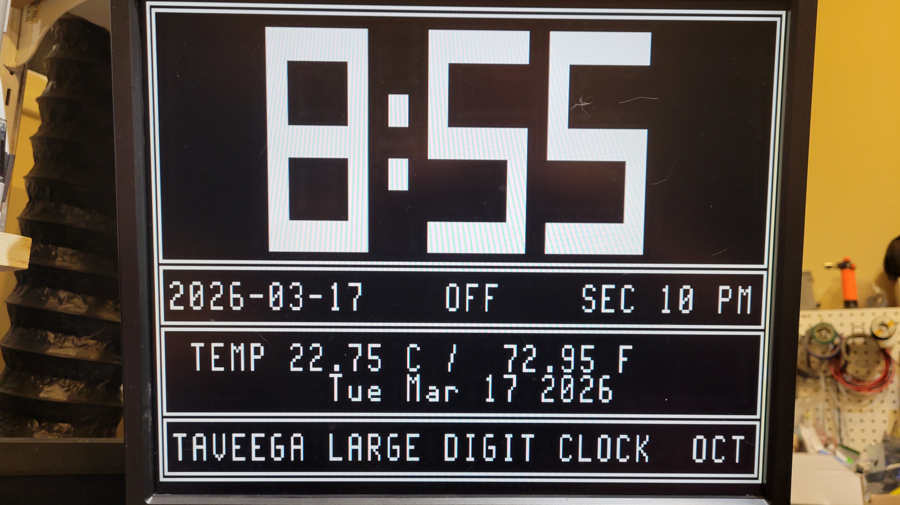

# Octapentaveega module and Arduino Nano 
## xtra Large Digit Clock
### Check out the other repositories for more information on the Octapentaveega module.
Simple clock using a old vga monitor and Arduino Nano with a DS1307/DS18B20 module.
Also using a relay to turn on the monitor and off the monitor outside work hours.
This is a example of using the full display and doing multiple things.
This display shows the time in xtra large digits, date in 2 formats, seconds, am/pm indicator, and for fun a scrolling marquee on the bottom.
In the images folder is a movie of the time going from 8:59 to 9:00 to show the rolling digit function.
Code for the demo is under project folder.

Will add more as I have time.

